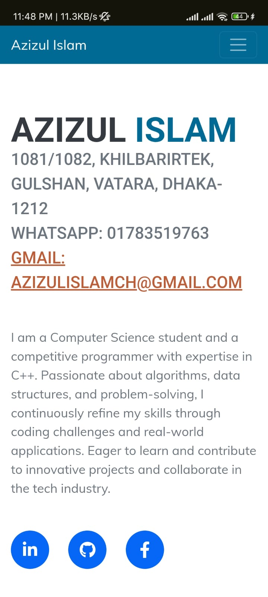
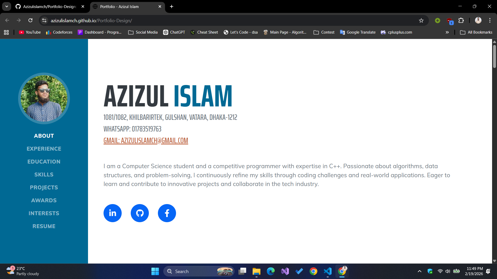

# 🌟 Portfolio Design


## 🚀 About

**Portfolio Design** is a **responsive personal portfolio website** that showcases my skills, projects, and achievements with a clean and modern UI.  
It’s perfect for presenting your work to employers, clients, or anyone visiting your GitHub.  
🔗 **Live Demo:** https://azizulislamch.github.io/Portfolio-Design/

---

## 🛠 Features

✨ Clean & user-friendly design  
📱 Fully responsive layout  
🖥️ Showcases skills, projects, and achievements  
📫 Contact section included  

---

## 📦 Technologies Used

✅ **HTML5**  
✅ **CSS3**  
✅ **JavaScript**

---

## 📸 Screenshots

### 📱 Mobile View  


### 💻 Desktop View  


---

## 🛠 Getting Started

To run this project locally:

```bash
# Clone the repo
git clone https://github.com/Azizulislamch/Portfolio-Design.git

# Move into the directory
cd Portfolio-Design

# Open index.html in your browser
```
---

## 📫 Contact Me

If you have questions, suggestions, or opportunities, feel free to reach out:

📧 Email: azizulislamch@gmail.com

🔗 LinkedIn: https://www.linkedin.com/in/azizul-islam-37b804246 